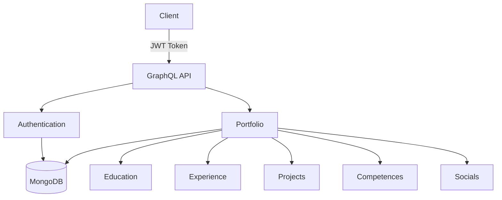
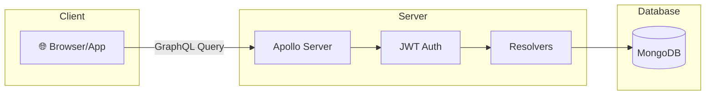
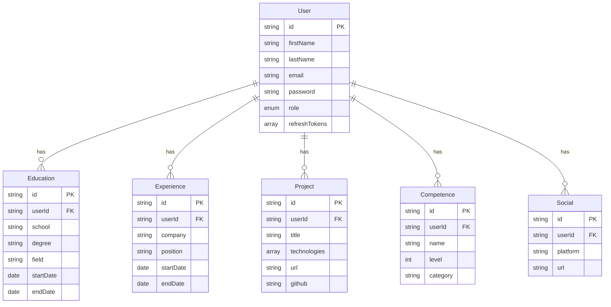
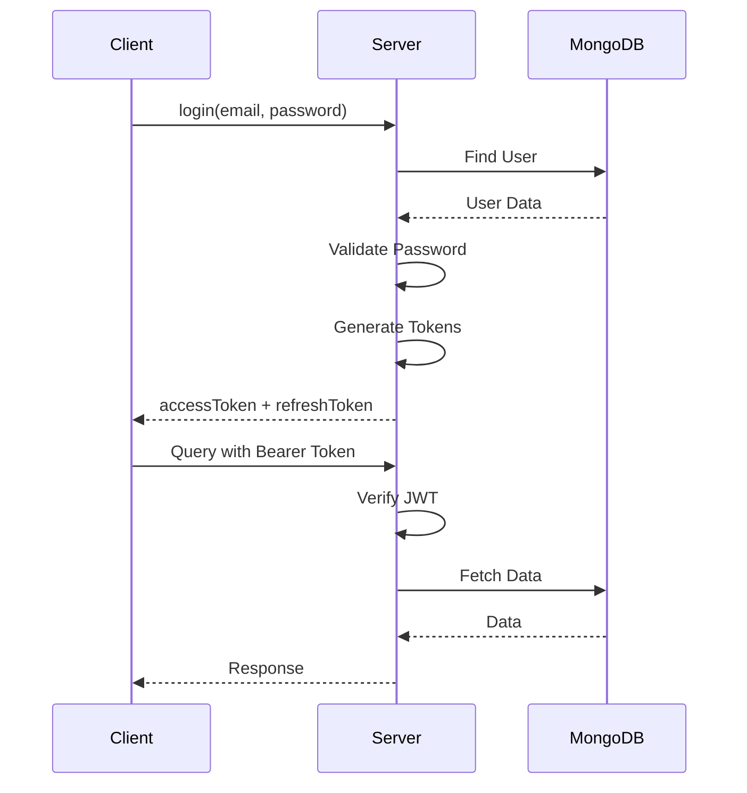
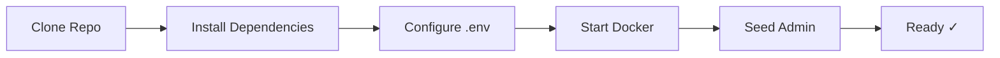

# Kardasch Portfolio API

<div align="center">



</div>

## Architecture



## Tech Stack

| Technology | Version | Purpose |
|------------|---------|---------|
| Node.js | 23-alpine | Runtime |
| TypeScript | Latest | Language |
| Apollo Server | v5 | GraphQL Server |
| MongoDB | 7 | Database |
| Mongoose | Latest | ODM |
| JWT | Latest | Authentication |
| Docker | Latest | Containerization |

## Data Model



## Authentication Flow



## API Endpoints

### 🔐 Authentication

| Mutation | Access | Description |
|----------|--------|-------------|
| `login` | Public | Get access & refresh tokens |
| `refreshToken` | Public | Refresh access token |
| `logout` | Auth | Revoke refresh token |

### 👤 User

| Query | Access | Description |
|-------|--------|-------------|
| `me` | Auth | Get current user |
| `portfolio` | Auth | Get complete profile |

### 📚 Education

| Operation | Access | Description |
|-----------|--------|-------------|
| `educations` | Auth | List all |
| `createEducation` | Admin | Create new |
| `updateEducation` | Admin | Update existing |
| `deleteEducation` | Admin | Delete |

### 💼 Experience

| Operation | Access | Description |
|-----------|--------|-------------|
| `experiences` | Auth | List all |
| `createExperience` | Admin | Create new |
| `updateExperience` | Admin | Update existing |
| `deleteExperience` | Admin | Delete |

### 🚀 Projects

| Operation | Access | Description |
|-----------|--------|-------------|
| `projects` | Auth | List all |
| `createProject` | Admin | Create new |
| `updateProject` | Admin | Update existing |
| `deleteProject` | Admin | Delete |

### 🎯 Competences

| Operation | Access | Description |
|-----------|--------|-------------|
| `competences` | Auth | List all |
| `createCompetence` | Admin | Create new |
| `updateCompetence` | Admin | Update existing |
| `deleteCompetence` | Admin | Delete |

### 🔗 Socials

| Operation | Access | Description |
|-----------|--------|-------------|
| `socials` | Auth | List all |
| `createSocial` | Admin | Create new |
| `updateSocial` | Admin | Update existing |
| `deleteSocial` | Admin | Delete |

## Setup



### Installation

```bash
# Clone
git clone https://github.com/kardasch404/Kardasch.git
cd Kardasch

# Install
npm install

# Environment
cp .env.example .env

# Docker
sudo docker-compose up -d

# Seed Admin
npm run seed
```

### Environment Variables

| Variable | Description | Default |
|----------|-------------|---------|
| `PORT` | Server port | 3000 |
| `MONGODB_URI` | MongoDB connection | mongodb://mongo:27017/kardasch |
| `JWT_ACCESS_SECRET` | Access token secret | - |
| `JWT_REFRESH_SECRET` | Refresh token secret | - |
| `JWT_ACCESS_EXPIRY` | Access token expiry | 15m |
| `JWT_REFRESH_EXPIRY` | Refresh token expiry | 7d |

## Usage

### Login

```graphql
mutation {
  login(
    email: "kardachezakaria45@gmail.com"
    password: "kardachezakaria45"
  ) {
    accessToken
    refreshToken
    user {
      id
      firstName
      lastName
      role
    }
  }
}
```

### Get Portfolio

```graphql
query {
  portfolio {
    user {
      firstName
      lastName
      email
    }
    educations {
      school
      degree
      field
    }
    experiences {
      company
      position
    }
    projects {
      title
      technologies
      url
    }
    competences {
      name
      level
      category
    }
    socials {
      platform
      url
    }
  }
}
```

### Create Project (Admin Only)

```graphql
mutation {
  createProject(
    title: "Portfolio API"
    description: "GraphQL API for portfolio"
    technologies: ["Node.js", "GraphQL", "MongoDB"]
    startDate: "2024-01-01"
    url: "https://example.com"
    github: "https://github.com/user/repo"
  ) {
    id
    title
  }
}
```

## Project Structure

```
Kardasch/
├── app/
│   ├── config/
│   │   └── config.ts
│   ├── constants/
│   │   ├── roles.ts
│   │   └── statusCodes.ts
│   ├── graphql/
│   │   ├── resolvers/
│   │   │   ├── auth.ts
│   │   │   ├── education.ts
│   │   │   ├── experience.ts
│   │   │   ├── project.ts
│   │   │   ├── competence.ts
│   │   │   ├── social.ts
│   │   │   ├── portfolio.ts
│   │   │   └── index.ts
│   │   └── schemas/
│   │       └── typeDefs.ts
│   ├── middlewares/
│   │   └── auth.ts
│   ├── models/
│   │   ├── User.ts
│   │   ├── Education.ts
│   │   ├── Experience.ts
│   │   ├── Project.ts
│   │   ├── Competence.ts
│   │   └── Social.ts
│   ├── services/
│   │   └── database.ts
│   ├── utils/
│   │   └── jwt.ts
│   ├── app.ts
│   └── server.ts
├── Docker/
│   ├── Dockerfile
│   └── docker-compose.yml
└── package.json
```

## Authorization Matrix

| Role | Read | Create | Update | Delete |
|------|------|--------|--------|--------|
| **ADMIN** | ✓ | ✓ | ✓ | ✓ |
| **VISITOR** | ✓ | ✗ | ✗ | ✗ |
| **Anonymous** | ✗ | ✗ | ✗ | ✗ |

## Status Codes

| Code | Description |
|------|-------------|
| 200 | Success |
| 201 | Created |
| 400 | Bad Request |
| 401 | Unauthorized |
| 403 | Forbidden |
| 404 | Not Found |
| 409 | Conflict |
| 500 | Internal Server Error |

## License

MIT
